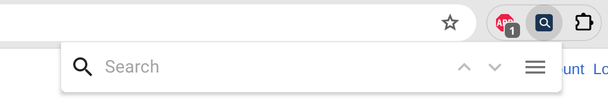
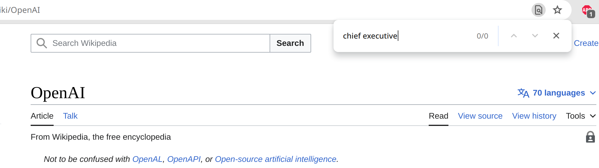
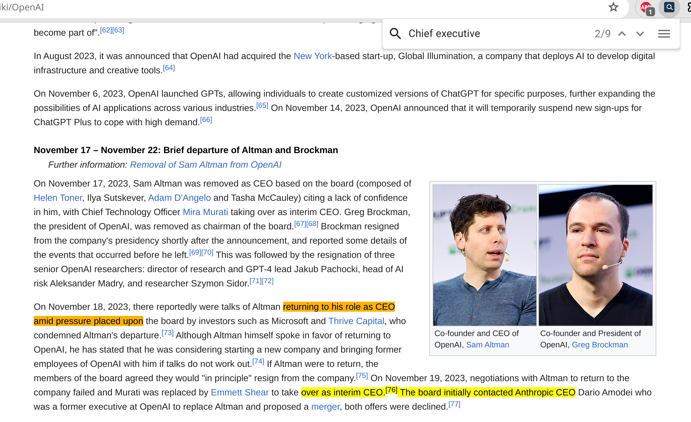
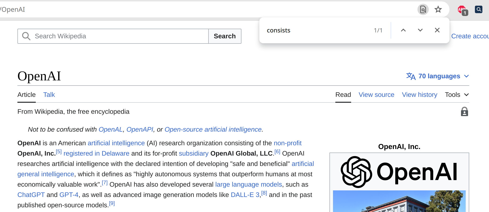
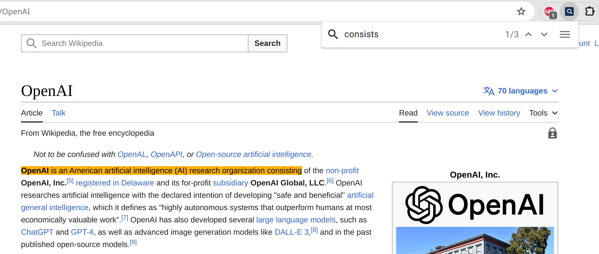
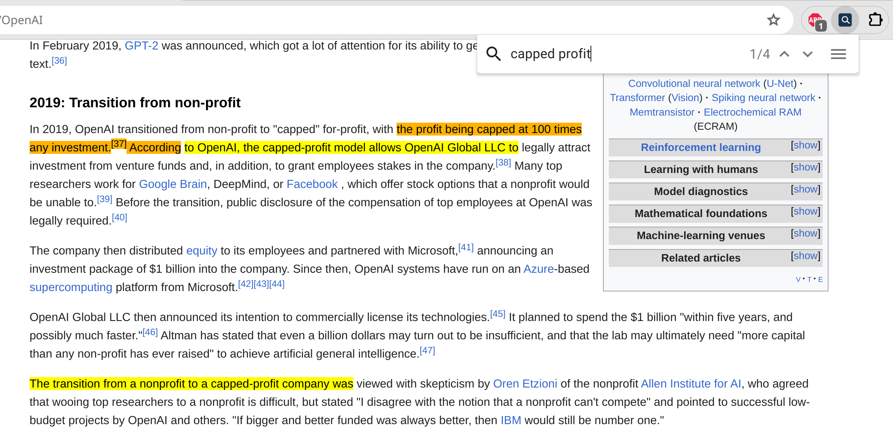
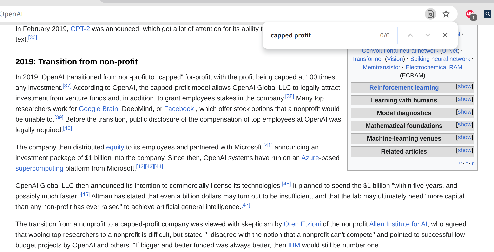

# CS 410 Project - Enhanced Search

## Team Members

- Ryan DeStefano (ryanfd2@illinois.edu)
- Justin Feinfield (justinf6@illinois.edu)

## Setup

To install the necessary libraries for development, run the following command from the [`enhanced_search`](enhanced_search) directory:

```
npm install
```

This extension uses OpenAI's [embeddings API](https://platform.openai.com/docs/guides/embeddings) to compute word embeddings for the words in the page to support a similarity search between the search query and documents in the page. In order to access this API and have the extension work properly, an OpenAI API key must be set at [App.tsx#L30](enhanced_search/src/App.tsx#L30).

To build the latest version of the extension, run the following command:

```
npm run build
```

Once the extension is built, you can install the extension in Chrome by going to `chrome://extensions`, turning on developer mode, selecting "Load unpacked", and loading the `enhanced_search/build` directory.

## Usage
The usage of this extension is the same as the standard Find in Page search feature from most browsers. The key difference between this extension and existing search features in browsers is that this extension can find matches that are not exact text matches. Examples of non-exact text matches that this extension can do are shown in the Results section.

### Search


The extension can be opened with the keyboard shortcut:

```
Ctrl+Shift+F
```

Next, the search query can be typed into the search bar. The results can be iterated through either by clicking the "Up" and "Down" arrows, or using the following keyboard shortcuts:

1. Increment: `Ctrl+Enter`
2. Decrement: `Ctrl+Shift+Enter`

### Adjust Settings


Users are able to adjust the settings of the similarity search to affect the match results. Settings can be changed by clicking the menu button on the extension:


The available settings are:
1. High: Cosine similarity greater than 0.8. Best for high precision and only relevant results
2. Medium: Cosine similarity greater than 0.7. Balances precision and recall, likely with some results that are less relevant.
3. Low: Cosine similarity greater than 0.6. Best for high recall, but will include some less relevant results as well.
4. All: Show up to 50 matches, with no filtering for minimum relevancy.


## Results
1. Synonyms

Often times when searching a web page, the exact word to search for is not known. For example, searching for "Chief executive" with a traditional exact text search will not return results for "CEO":



But using the Enhanced Search extension does find the relevant results:


2. Different Tense

Exact search does not match terms that have the same base word, but in a different tense. For example, if searching for the subsidiaries that OpenAI consists of, the search term "consists" return no relevant results for exact search:



However, using Enhanced Search matched the relevant result, even though the result term does not match exactly:



3. Incomplete Match of Phrases

Searching for a phrase can be extremely difficult when using exact search because the exact ordering and tense of words needs to be matched exactly. However, Enhanced Search is able to handle matching phrases, even if the search query uses different words and word order.

Searching for "capped profit" using Enhanced Search matches phrases including "capped for-profit," "profit being capped," and "capped-profit":



The same search query using exact search does not match any terms:

